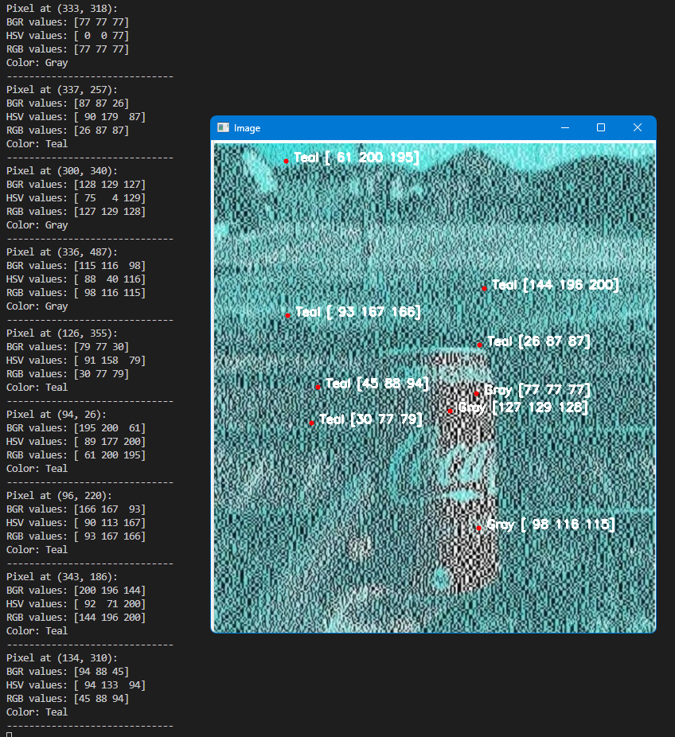

# Pixel Color Detector

A Python tool that detects and displays color information for any pixel in an image using both BGR and HSV color spaces.

 *(Replace with actual screenshot)*

## Features

- **Dual Color Space Analysis**:
  - BGR (Blue, Green, Red) - OpenCV's native format
  - HSV (Hue, Saturation, Value) - More accurate for color detection
- **Interactive Interface**:
  - Click on any pixel to see its color information
  - Visual markers show where you clicked
- **Detailed Color Information**:
  - Color name detection (12+ colors)
  - RGB and BGR values
  - HSV values
- **Special Cases Handling**:
  - Distinguishes between shades, tints, and pure colors
  - Properly identifies black, white, and gray regardless of hue

## Installation

1. Clone the repository:
   ```bash
   git clone https://github.com/your-username/pixel-color-detector.git
   cd pixel-color-detector
Install dependencies:

bash
pip install opencv-python numpy
Usage
Run the script with Python:

bash
python color_detector.py
When prompted, enter the path to your image file.

Interactive Controls:
Left-click on any pixel to see its color information

Press 'q' to quit the application

Color Detection Logic
HSV Color Ranges
Color	Hue Range	Saturation	Value
Red	0-10 or 170-180	> 50	> 30
Orange	10-25	> 50	> 30
Yellow	25-35	> 50	> 30
Green	35-80	> 50	> 30
Teal	80-100	> 50	> 30
Blue	100-130	> 50	> 30
Purple	130-150	> 50	> 30
Pink	150-170	> 50	> 30
White	Any	< 50	> 200
Gray	Any	< 50	30-200
Black	Any	Any	< 30
Example Output
text
Pixel at (320, 240):
BGR values: [ 36 158 229]
HSV values: [ 20 215 229]
RGB values: [229 158  36]
Color: Orange
------------------------------
Customization
You can adjust the color detection by modifying:

HSV ranges in get_color_name_hsv() function

Add more color categories as needed

Change the display text format in click_event()

Contributing
Contributions are welcome! Please open an issue or pull request for:

Additional color categories

Improved detection algorithms

New features
